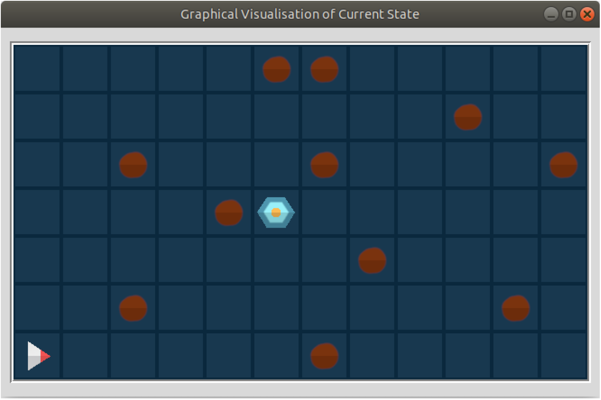

# Spaceship & Asteroids arcade game - B specification

B specification of a very simple version of the old Spaceship & Asteroids arcade game, using the B tools: Atelier B & ProB.

Features a graphical view, which uses an animation function.

Implemented for the coursework of the module: _Reasoning About Programs (6SENG001W)_ in 2018, at Informatics Institute of Technology (IIT), Sri Lanka, in collaboration with University of Westminster.
